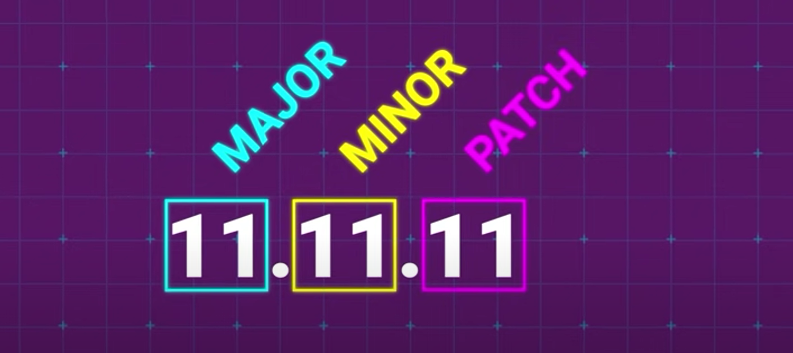

# <u>NPM - Node Package Manager</u>

<br>

- To install a package locally on your project
    ```
    npm install chalk
  ```
  
<br>


- To install a package globally , so we can access it anywhere using cli
    ```
  npm install -g chalk
  ```

<br>


- To install a package with latest version
    ```
  npm install react@latest
  // or 
  npm install react@18
  ```

<br>


- To update a package for its minor or patch updates
    ```
  npm update
  ```

<br>


- To update a package by limiting on its minor version and update its latest patch version , we can use tilde symbol
    ```
  npm install chalk@~2.2
  ```


<br>


- To create a file that stores all the necessary information abut your project. You can create a json file
    ```
  npm init
  ```
  
    And if you don't want to answer any question and want to store default answer and change them later , we can use the commdand
    ```
  npm init -y
  ```

<br>


- To install all the packages or dependencies listed in package.json file in one go 
  ```
  npm install // Run the command in the folder having packge.json
  ```

<br>


- To view all the versions released of a particular package
  ```
  npm view react versions
  ```

<br>


  ### The Structure of version of npm packages
  


<br>


```
npm fund
```


```This command retrieves information on how to fund the dependencies of a given project. If no package name is provided, it will list all dependencies that are looking for funding in a tree structure, listing the type of funding and the url to visit```